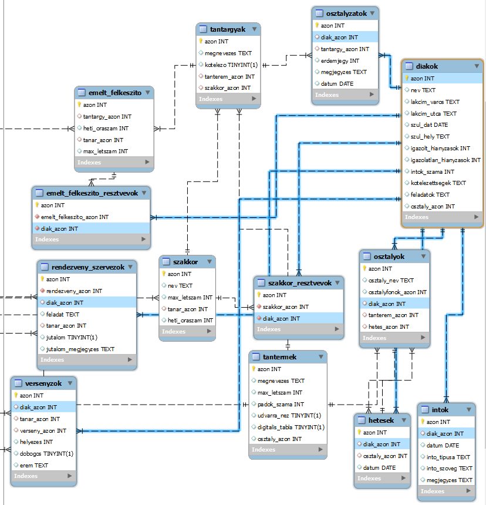
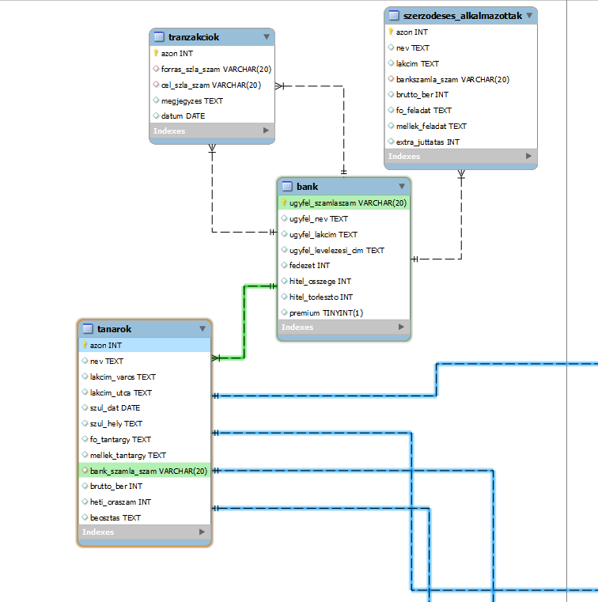

### FONTOS INFORMÁCIÓ!
Az itt felhasznált nevek,címek,bankszámla számok mind FIKTÍV ADATOK amiket python scriptekkel generáltam.

Az ehhez használt dataset és scriptek a DEV mappában elérhetőek, reprodukálhatóak.

Ez az adatbázis kizárólag fiktív és "szórakoztató" célból lett létrehozva. Az itt található adatok teljes egészében véletlenszerűen generáltak, és semmilyen valóságalapja vagy összefüggése nincs a valóságban előforduló eseményekkel vagy személyekkel.

Bár mindent megtettünk annak érdekében, hogy az adatok hitelesek és pontosak legyenek, nincs garancia arra, hogy azok tükrözik a valóságot . Minden információ a képzelet szüleménye, és semmilyen körülmények között nem tekinthető hiteles forrásnak.

Az adatbázisban található információk semmilyen formában nem szolgálnak jogi, pénzügyi vagy egyéb tanácsadásként. Semmilyen felelősséget nem vállalunk az adatok használatából vagy értelmezéséből eredő esetleges károkért vagy veszteségekért.

Felhívjuk figyelmüket, hogy minden felhasználónak a saját felelőssége, hogy az adatokkal miként bánik, és fenntartjuk a jogot arra, hogy bármikor módosítsuk vagy töröljük az adatokat anélkül, hogy erről előzetesen értesítenénk.

Kérjük, vegyék figyelembe ezt a felhívást az adatok böngészése és felhasználása során.

#### INFO
Üdv minden kedves látogatónak.
Ez egy gyakorló adatbázis, ami egy nem létező iskola (*ILYEN NINCS, ÁLTALÁNOS ISKOLA ÉS GIMNÁZIUM*) diákjait, tanárait és néhány érdekesebb, iskolai élethez hozzátartozó események/helyszínek/stb... adatait tartalmazza.
A szintaxis MySQL/MariaDB-hez lett alakítva. Nem kizárt, hogy más adatbázisokkal (pl Postgres/MSSQL/Oracle/stb...) is működik, de ha nem, akkor nyílván át kell írni szintaxis helyesre.
Ha bármi hibába ütköztök, nyugodtan nyissatok egy "issue"-t itt githubon és ahogy időm engedi, ránézek (Ne várjatok túl gyors reakciót pls)

#### Miért is született meg ez a DB?
Egyszerű: 
 1. Azért, hogy emelt infó érettségizők tudjanak gyakorolni (ha már unalmas a korábbi évek érettségije)
 2. Ha szeretnéd kipróbálni, milyen egy picit nagyobb adatbázison dolgozni
 3. Ha csak felfrissítenéd a tudásod és a "Northwind" már kicsi :D 

##### TELEPÍTÉS
1. Töltsétek le az *SQL* mappa tartalmát (vagy egyesével másoljátok ki őket majd)
2. Nyissátok meg a kedvenc SQL klienseteket
3. Számozás sorrendjének megfelelően kezdjétek el beimportálni/bemásolni és megfuttatni az SQL mappában lévő *.sql* scripteket.
     Számozás 00-tól kezdődik, így mindenképpen a *01_adatbazis_letrehozas.sql* legyen az első, a *21_idegen_kulcsok.sql* pedig az utolsó amit megfuttattok.
4. Ha végig értek mind a 21 db sql scripten, akkor előáll a gyakorló adatbázisotok.

##### FELADATOK
A feladatok mappában vannak. 4 kategória van
 - Bevezető - annyiról szól, hogy ismerd meg az adatbázis sémáját. Azért fontos, hogy nagyjából képben legyél vele, mert ezzel spórolhatsz meg magadnak egy tonna időt (főleg érettségin). A hangsúly azon van, hogy nagyjából képben legyél azzal, hogy az adatbázisban mikről milyen adatokat tárolunk (pl Diákokról tároljuk a nevüket,lakcímüket,stb... és ezeket mind a *diakok* táblában). Ezáltal kevesebbet kell majd feladat megoldása közben a db EK diagramját (Egyed-Kapcsolat Modell -> ahol "össze vannak kötögetve a táblák") böngészni, azt keresve, hogy melyik táblából is kéne kihalászni melyik adatot
 - Könnyű - sima, egyszeri (tehát nem beágyazott) SELECT lekérdezésekkel és néhány alap szűréssel megoldhatók. Szükséges még pár alap aggregáló (csoportosító) függvény ismerete (pl MIN, MAX, AVG)
 - Közepes - Minden ami a könnyűben van + JOINOK (LEFT,RIGHT,INNER,NATURAL), SUBQUERY (allekérdezés),
 - Nehéz - GROUP BY, HAVING, INSERT, UPDATE, DELETE (azért kerültek a nehéz kategóriába, mert érettségin csekély mértékben fordulnak elő + ezeknek a feladatoknak a nagy részéhez figyelembe kell venni az idegen kulcsokat)

##### Adatbázis Felépítése
Itt átvesszük, milyen táblák, mezők és adattípusokat tartalmaz az adatbázis és annak felépítését.

Iskola lévén, a középpontban a *Diákok* vannak.


A *diakok* táblában tároljuk az egyes diákokat és adataikat az alábbi módon:
```
azon - a diák azonosítója (ID-ja) az adatbázisban. automatikusan generált szám
nev - a diák teljes neve
lakcim_varos - diák lakhelye (város)
lakcim_utca - diák lakcíme (utca + házszám)
szul_dat - diák születési dátuma
szul_hely - diák születési helye
igazolt_hianyzasok - az adott diák igazolt hiányzásai
igazolatlan_hianyzasok - az adott diák igazolatlan hiányzásai
kotelezettsegek - alapvetően üres érték, a feladatokban töltjük fel értékkel. A diák elvállalt kötelezettségeit tároljuk it, amit jobb magatartás/szorgalom jegyért cserébe elvállalhat
feladatok - alapvetően üres. Diákra kiszabott büntető feladat, amit rossz magaviseletéért teljesítenie kell
osztaly_azon - a diák osztályának az azonosítója (osztályok tábla 'azon' oszlopára hivatkoik)
```
Minden diák egy adott osztálynak a tagja. Az osztályok 1-13-ig vannak számozva, ezeken belül 3 osztály lehet: A,B és C
ezek az *osztalyok* táblában vannak tárolva
```
azon - osztály azonsosítója
osztaly_nev - osztály neve (pl 9.C)
osztalyfonok_azon - az osztályfőnök azonosítója (tanárok tábla 'azon' oszlopára hivatkoik)
diak_azon - üres, már nem használt mező, későbbi verzióban majd törlésre kerül. ne foglalkozzatok vele
tanterem_azon - az osztály tantermének azonosítója (tanterem tábla 'azon' oszlopára hivatkoik)
hetes_azon - az osztály hetesének azonosítója (hetesek tábla 'azon' oszlopára hivatkoik)
```
Minden osztálynak van egy tanterme, amikről a következő adatokat tároljuk a *tantermek* táblában
```
azon - tanterem egyedi azonosítója a táblában
megnevezes - tanterem neve
max_letszam - terem max létszáma
padok_szama - padok száma
udvarra_nez - udvarra néző ablakai vannak-e vagy sem (Bool)
digitalis_tabla - van-e a teremben digitális tábla, vagy sem (Bool)
osztaly_azon - osztály azonosító, használaton kívüli, de lehet lesz rá feladat
```
A nem megfelelő magatartást tanusító diákok részesülhetnek megrovásban. Ezeket az *intok* táblában találjuk. 
```
azon - az intő azonosítója
diak_azon - diák azonosítója (diakok tábla 'azon' oszlopára hivatkoik)
datum - beírás dátuma
into_tipusa - az intő típusa (szaktanári, osztályfőnöki, igazgatói)
into_szoveg - az intő tartalma
megjegyzes - jelenleg üres, lesz majd rá feladat
```
Minden diáknak vannak tantárgyai. Az egyes tantárgyakat a *tantargyak* táblában találjuk és a következőket tároljuk róla
```
azon - tantárgy azonosítója
megnevezes - tárgy megnevezése (pl: Matematika)
kotelezo - Bool (igaz/hamis), jelzi, hogy egy tantárgy kötelező-e vagy fakultatív. jelenleg üres, feladatokban fogjuk kitölteni
tanterem_azon -  üres, már nem használt mező, későbbi verzióban majd törlésre kerül. ne foglalkozzatok vele
szakkor_azon - ha van szakkör a tantárgyhoz, akkor annak a szakkörnek az azonosítója van itt. jelenleg üres, feladat lesz rá.
```
A egyes tantárgyakhoz az év során a diákoknak kötelező érdemjegyet szerezni. Ezeket az *osztalyzatok* táblában tároljuk
```
azon - osztályzat azonosítója
diak_azon- diák azonosítója (diakok tábla 'azon' oszlopára hivatkoik)
tantargy_azon - tantárgy azonosítója (tantargyak tábla 'azon' oszlopára hivatkoik)
erdemjegy - kapott érdemjegy
megjegyzes - esetleges megjegyzes (alapvetően üres)
datum - érdemjeg ybeírásának dátuma
```

A diákoknak szintén lehetőségük van az egyes tantárgyakból emeltszintű érettségi felkészítőre (csak 9. osztály felett) és szakkörökre (1. - 13. osztályig bárki) is járni.
Azokat a tantárgyakat, amikből indult az évben emeltszintű felkészítő az *emeltfelkeszito* táblában találjuk
```
azon - egyedi azonosító az egyes felkészítőkhöz a táblán belül
tantargy_azon - tantárgy azonosító (tantargyak  tábla 'azon' oszlopára hivatkoik)
heti_oraszam - hány óra van belőle egy héten
tanar_azon - tanár azonosítój (tanarok  tábla 'azon' oszlopára hivatkoik)
max_letszam - max létszám.
```
Azt, hogy melyik diák melyik felkészítőre jár, azt az *emelt_felkeszito_resztvevok* kapcsoló tábla tárolja
```
azon - egyedi azonosító
emelt_felkeszito_azon - emeltszintű felkészítő azonosítója ( emelt_felkeszito  tábla 'azon' oszlopára hivatkoik)
diak_azon - diák azonosítója (diakok  tábla 'azon' oszlopára hivatkoik)
```
A szakköröket hasonló felosztásban tartjuk nyílván, csak a *szakkor* és a *szakkor_resztvevok* táblákban, melyeknek rendre ugyanez a felépítése.

A legalább 14. életévüket betöltött diákoknak lehetőségük van (tanári felügyelete mellett) az egyes, iskola által rendezett rendezvényeken segíteni.
Ezeket az adatokat *rendezveny_szervezok* táblában tároljuk
```
azon - rekord egyedi azonosítója a táblán belül
rendezveny_azon - rendezvény azonosítója (rendezvenyek  tábla 'azon' oszlopára hivatkoik)
diak_azon - diák azonosítója (diakok  tábla 'azon' oszlopára hivatkoik) (Csak akkor szerepel benne érték, ha az adott rekord egy diákra utal)
feladat - az adott diák/tanár feladata a rendezvényen
tanar_azon - tanár azonosítója (tanarok  tábla 'azon' oszlopára hivatkoik) (Csak akkor szerepel benne érték, ha az adott rekord egy tanárra utal)
jutalom - rendezvényen való segédkezésért jár-e jutalom (Bool)
jutalom_megjegyzes - egyéb megjegyzés a jutalomhoz
```
Természetesen a rendezvényeket egy külön táblában tároljuk. a *rendezvenyek* tábla oszlopai:
```
azon - egyedi azonosító
megnevezes - rendezvény neve
datum - rendezvény időpontja
max_letszam - maximum létszáma azoknak a vendégeknek, akik egyidőben voltak jelen a rendezvényen
helyszin - a rendezvény helyszíne. alapvetően üres, majd feladatok által kapnak értéket
terem_azon - terem azonosítója, ahova a rendezvény eredetileg tervezték (A tantermek  tábla 'azon' oszlopára hivatkoik)
```

A diákoknak szintén lehetőségük van különböző versenyeken részt venni. A versenyeken résztvevő diákokról az alábbi adatokat tároljuk a *versenyzok* táblában
```
azon - verseny egyedi azonosítója
diak_azon - diák azonosító (diakok tábla 'azon' oszlopára hivatkoik)
tanar_azon - kísérő tanár azonosítója (tanarok tábla 'azon' oszlopára hivatkoik)
verseny_azon - verseny azonosítója (versenyek tábla 'azon' oszlopára hivatkoik)
helyezes - diák által elért helyezés a versenyen
dobogos - dobogós-e a diák? alapvetően üres, feladatban kell kitölteni
erem - milyen érmet kapott a helyezésért? alapvetően üres, majd feladat lesz hozzá
```

Nyílván, a versenyek egy külön táblában vannak tárolva. a *versenyek* tábla oszlopai:
```
azon - egyedi azonosító
datum - verseny dátuma
megnevezes - verseny neve
sport_azon - sport azonosítója, amin a verseny alapul (sport tábla 'azon' oszlopára hivatkoik)
```
Végül pedig az egyes sportágakat pedig a *sport* táblában tároljuk
```
azon - sportág azonosítója
megnevezes - sportág neve
```

Rengeteg táblában szerepelnek, de még nem beszéltünk róluk; ők a Tanárok


Adataikat a *tanarok* táblában kell keresnünk.
```
azon - a diák azonosítója (ID-ja) az adatbázisban. automatikusan generált szám
nev - a diák teljes neve
lakcim_varos - diák lakhelye (város)
lakcim_utca - diák lakcíme (utca + házszám)
szul_dat - diák születési dátuma
szul_hely - diák születési helye
fo_tantargy - A tanár által tanított elsődleges tantárgy
mellek_tantargy - A tanár által tanított másodlagos tantárgy
bank_szamla_szam - Tanár bankszámla száma (bank tábla 'ugyfel_szamlaszam' oszlopára hivatkoik)
brutto_ber - a tanár bruttó bére, üres, majd feladat lesz rá
heti_oraszam - hány órát tanít a héten
beosztas - beosztás, pl tanársegéd, gyakorlati oktató, mérnöktanár, műszaki tanár, tagozat vezető, igazgató, stb... alapvetően üres, majd feladat által lesznek kitöltve
```
Az iskola, még számos vállalkozóval áll kapcsolatban, akik bizonyos alkalmi, iskola körüli munkálatokat szoktak elvégezni.
Az ő adataik a *szerzodeses_alkalmazottak* táblában lelhetőek fel, amik:
```
azon - egyedi azonosító
nev - vállalkozó/vállalkozás neve
lakcim - vállalkozó/vállalkozás lakcíme
bankszamla_szam - vállalkozó/vállalkozás számlaszáma
brutto_ber - bruttó bére 
fo_feladat - vállalkozó/vállalkozás által nyújtott fő szolgáltatás
mellek_feladat - vállalkozó/vállalkozás által nyújtott másodlagos szolgáltatás
extra_juttatas - nincs használatban, de lehet lesz rá feladat
```

A tanárok és vállalkozók többségének a lokális 'Ilyen Biztos Nincs (IBN)' Banknál vezetett bankszámlájuk van 
A bank az ügyfeleiről az alábbi adatokat tárolja:
```
ugyfel_szamlaszam - bankszámla szám. Egyedi, nem lehet null. nem töltődik automatikusan
ugyfel_nev - ügyfél neve
ugyfel_lakcim - ügyfél lakcíme
ugyfel_levelezesi_cim - ügyfél levelezési címe
fedezet  - ügyfél számláján lévő fedezet
hitel_osszege - ügyfél hitelének összege
hitel_torleszto - ha van hitele, akkor mennyi annak a havi törlesztője
premium - prémium ügyfél? (Bool)
```

Mint minden bank, a pénzügyi tranzakciókat nyílván kell, hogy tartsa. Erre a célra lett a *tranzakciok* tábla létrehozva.
Ebben a táblában csak a bankon belüli utalásokat jegyzik fel.
```
azon - tranzakció azonosítója
forras_szla_szam - forrás számlaszám, AHONNAN a pénzt utaláták (bank tábla 'ugyfel_szamlaszam' oszlopára hivatkoik)
cel_szla_szam - cél számlaszám, AHOVÁ a pénzt utalták (bank tábla 'ugyfel_szamlaszam' oszlopára hivatkoik)
megjegyzes tranzakció megjegyzese
datum - utalás dátuma
```

